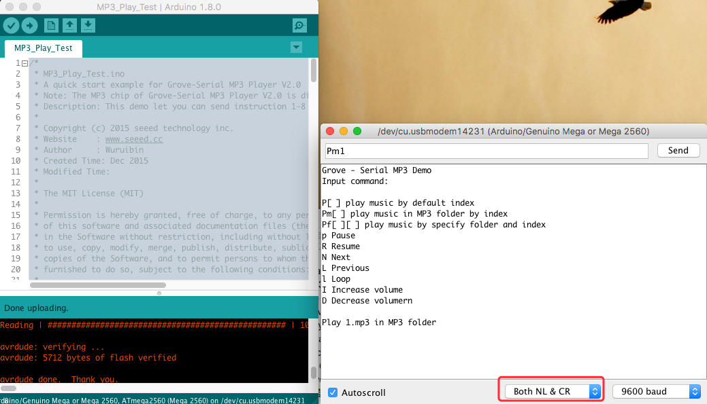

Grove – Serial MP3 Player V2.0
--------------------------------


[Grove - MP3 v2.0](https://www.seeedstudio.com/Grove-MP3-v2.0-p-2597.html)

The MP3 chip of Grove-Serial MP3 Player V2.0 is different from Grove-Serial MP3 Player V1.0.
Grove-Serial MP3 Player V2.0 is a kind of simple MP3 player device whose design is based on a high-quality MP3 audio chip---KT403A. 

### Play musci in three functionalities
- No specified folder name or music file name, you can store MP3 files any where in microSD card.
	```
	SpecifyMusicPlay(index);
	```
	
- Play music by specified folder and file index. 	
	```
	SpecifyfolderPlay(folder, index);
	```

	Folder and files' names rules:
	
	01/001***.mp3	

	01/002***.mp3

	01/999***.mp3
	
	03/001***.mp3
	
	04/002***.mp3

- play music in MP3 folder.
	```
	PlayMP3folder(index);
	```

	Names rules:

	MP3/0001.mp3

	MP3/0002.mp3

	MP3/0003.mp3

	MP3/0004.mp3


### Use Arduino Serial monitor to operate the demo **Music_Play_Test.ino**


For more information please visit [wiki](http://wiki.seeedstudio.com/Grove-MP3_v2.0/).    

----

This demo is licensed under [The MIT License](http://opensource.org/licenses/mit-license.php). Check License.txt for more information.<br>

Contributing to this software is warmly welcomed. You can do this basically by<br>
[forking](https://help.github.com/articles/fork-a-repo), committing modifications and then [pulling requests](https://help.github.com/articles/using-pull-requests) (follow the links above<br>
for operating guide). Adding change log and your contact into file header is encouraged.<br>
Thanks for your contribution.

Seeed Studio is an open hardware facilitation company based in Shenzhen, China. <br>
Benefiting from local manufacture power and convenient global logistic system, <br>
we integrate resources to serve new era of innovation. Seeed also works with <br>
global distributors and partners to push open hardware movement.<br>


[](https://github.com/igrigorik/ga-beacon)


